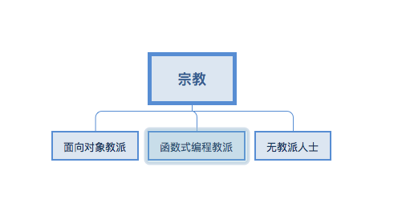

# JS面向对象之一 【概述】

文中的部分例子和理解结合自方应杭的【JS深入浅出】https://xiedaimala.com/courses/24f54465-854f-4de7-9808-72a0bf5b3181
 

在学习JS的面向对象之前,我们应该先自问这样几个问题:

- 面向对象是什么意思?
- 学习面向对象的核心是什么?
- 为什么要学习面向对象?(它的存在是为了解决什么需求的)

## 理解面向对象

【面向对象】四个字,字面意思其实是不太好理解的,你可以试着认为它是一种写代码的套路; 当然还存在其他的套路,比如【函数式编程】。

更形象的,我们还可以将面向对象理解为一种宗教信仰。

这样的话,世界上的程序员分为N种:

- 面向对象教派: 面向对象教的核心是类
- 函数式编程教派 : 函数式编程教派的核心是函数
- 无教派人士

## 面向对象的核心 (JS里的构造函数 和 其他语言的类)

这样很和谐,你可以自由入教,但是JS的特殊之处在于,这本语言中没有"类"这个概念。这就导致面向对象教的程序员们在写JS时就很难受。

所以JS为了满足信仰面向对象教的需求,通过构造函数的形式,模拟了伪"类"。

通俗的理解一下类和JS里构造函数的含义:
> 类的定义 : 如果一个东西返回了对象,那么这个东西就叫做类

> JS里的构造函数: 如果一个函数返回了一个新的对象,JS中就叫做构造函数

到现在为止,我们学习了2个知识点:

- 1 我们理解了面向对象其实是一种写代码的套路。
- 2 这个套路的核心就是"类",那么JavaScript里没有"类",所以其实是通过构造函数来模拟的伪"类"。

## 面向对象这个套路,是为了解决什么问题的?

一般认为,面向对象的好处,或者说面向对象的三面大旗: 封装、继承、多态

- 封装的好处: 隐藏细节,减少思维的负担。
- 继承的好处: 复用代码,避免内存空间的浪费。
- 多态好处:  让代码更灵活通用。例如div既是是节点,也是元素。(这个我也理解欠佳)

另一种说法是,面向对象只是一个套路,不管什么业务需求都按照面向对象的思维去写,像一种定势思维。

