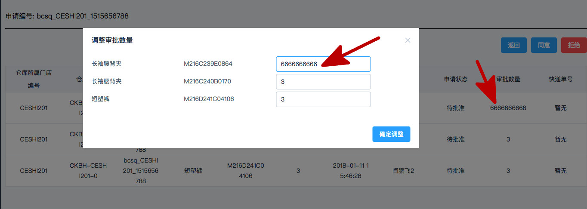

# 一篇文章彻底说清JS的深拷贝and浅拷贝

## 这篇文章的受众

- 第一类,业务需要,急需知道如何深拷贝JS对象的开发者。
- 第二类,希望扎实JS基础,将来好去面试官前秀操作的好学者。

## 写给第一类开发者


> 你只需要一行黑科技代码就可以实现深拷贝

```
var copyObj = {
    name: 'ziwei',
    arr : [1,2,3]
}

var targetObj = JSON.parse(JSON.stringify(copyObj))

此时 copyObj.arr !== targetObj.arr  已经实现了深拷贝 

```

> ***别着急走,利用window.JSON的方法做深拷贝存在2个缺点:***

- 如果你的对象里有函数,函数无法被拷贝下来
- 无法拷贝copyObj对象原型链上的属性和方法


当然,你明确知道他们的缺点后,如果他的缺点对你的业务需求没有影响,就可以放心使用了,一行原生代码就能搞定。

目前我在开发业务场景中,大多还真可以忽略上面2个缺点。往往需要深拷贝的对象里没有函数,也不需要拷贝它原型链的属性。


## 写给第二类好学者

下面我会尽可能全面的讲解清楚JS里对象的拷贝,要讲清楚拷贝,你需要一点点前置知识

你需要的前置知识:
- 理解JS里的引用类型和值类型的区别,知道Obj存储的只是引用
- 对原型链有基本了解 


关于对象拷贝的全部:

- 1.深拷贝、浅拷贝是什么
- 2.深拷贝、浅拷贝在业务里的最常见的应用场景
- 3.深拷贝和浅拷贝的实现方式
- 4.总结与建议


### 1.深拷贝、浅拷贝是什么

> 我们讨论JS对象深拷贝、浅拷贝的前提

只有对象里嵌套对象的情况下,才会根据需求讨论,我们要深拷贝还是浅拷贝。

比如下面这种对象
```
var obj1 = {
    name: 'ziwei',
    arr : [1,2,3]
}
```

因为,如果是类似这样{name: 'ziwei'},没有嵌套对象的对象的话,就没必要区分深浅拷贝了。只有在有嵌套的对象时,深拷贝和浅拷贝才有区别

> 浅拷贝是什么样子的 (我们暂时不管具体如何实现,因为下面会单讲)

 调用shallowCopy()后,obj2拷贝obj1所有的属性。但是obj2.arr和obj1.arr是不同的引用,指向同一个内存空间
```
 var obj2 = shallowCopy( obj1 , {})
 
 console.log( obj1 !== obj2 )                   // true    无论哪种拷贝,obj1和obj2一定都是2个不同的对象(内存空间不同)
 
 console.log( obj2.arr === obj1.arr )            // true   他们2个对象里arr的引用,指向【相同的】内存空间
    
    
```
***所以, 2个obj经过拷贝后,虽然他们属性相同,也的确是不同的对象,但他们内部的obj都是指向同一个内存空间,这种我们叫浅拷贝***


> 深拷贝是什么样子的 (我们暂时不管具体如何实现,因为下面会单讲)

调用deepCopy()后,obj2拷贝obj1所有的属性,而且obj2.arr和obj1.arr是指向不同的内存空间,

2个obj2除了拷贝了一样的属性,没有任何其他关联。
```
 var obj2 = deepCopy( obj1 , {})
 
 console.log( obj1 !== obj2 )                   // true    无论哪种拷贝,obj1和obj2一定都是2个不同的对象(内存空间不同)
 
 console.log( obj2.arr === obj1.arr )            // false   他们2个对象里arr的引用,指向【不同的】内存空间
    
    
```
***所以, 2个obj经过拷贝后,除了拷贝下来相同的属性之外,没有任何其他关联的2个对象,这种我们叫深拷贝***


###  2.深拷贝在业务里的最常见的应用场景


举个栗子,业务需求是 : 一个表格展示商品各种信息,点击【同意】时,是可以弹出对话框调整商品数量的。

这种业务需求下,我们就会用到对象的深拷贝。因为【商品表格】的属性和【调整商品表格】的属性几乎一样,我们需要拷贝。

下面的伪代码和图片就是展示使用浅拷贝存在的问题



这样得到的adjustTableArr和tableArr里,内部对象都是相同的,所以就出现了图中红线标注的情况,

当我们修改【调整商品表格】里的商品数量时,【商品表格】也跟着改变了,这并不是我们想要的
```

// 表格对象的数据结构
var tableArr = [
        {goods_name : '长袖腰背夹' , code : 'M216C239E0864' , num : '2'},
        {goods_name : '长袖腰背夹' , code : 'M216C240B0170' , num : '3'},
        {goods_name : '短塑裤' , code : 'M216D241C04106' , num : '3'},
    ]
    
var adjustTableArr = []                  // 调整表格用的数组

for (var key in tableArr) {               // 浅拷贝
    adjustTableArr[key] = tableArr[key]
}

```

而实际上,我们希望这2个表格里的数据完全独立,互不干扰,只有在确认调整之后才刷新商品数量。

这种情况下我们就可以使用前面说的深拷贝的一行黑科技

```
var adjustTableArr = JSON.parse(JSON.stringify(tableArr))

```
还记得它的缺陷吗? 对象里的函数无法被拷贝,原型链里的属性无法被拷贝。这里就对业务没有影响,可以很方便的深拷贝。


### 3.深拷贝和浅拷贝的实现方式

其实JQ里已经有$.extend()函数,实现就是深拷贝和浅拷贝的功能。有兴趣的小伙伴也可以看看源码。

> 浅拷贝

浅拷贝比较简单,就是用for in 循环赋值
```
    function shallowCopy(source, target = {}) {
        var key;
        for (key in source) {
            if (source.hasOwnProperty(key)) {        // 意思就是__proto__上面的属性,我不拷贝
                target[key] = source[key];
            }
        }
        return target;
    }
```


> 深拷贝的实现


- 深拷贝,就是遍历那个被拷贝的对象
- 判断对象里每一项的数据类型
- 如果不是对象类型,就直接赋值,如果是对象类型,就再次调用deepCopy,递归的去赋值。

```
    function deepCopy(source, target = {}) {
        var key;
        for (key in source) {
            if (source.hasOwnProperty(key)) {                         // 意思就是__proto__上面的属性,我不拷贝
                if (typeof(source[key]) === "object") {               // 如果这一项是object类型,就递归调用deepCopy
                    target[key] = Array.isArray(source[key]) ? [] : {};
                    deepCopy(source[key], target[key]);
                } else {                                            // 如果不是object类型,就直接赋值拷贝
                    target[key] = source[key];
                }
            }
        }
        return target;
    }

```

以上的无论深、浅拷贝,都用了source.hasOwnProperty(key),意思是判断这一项是否是其自有属性,是的话才拷贝,不是就不拷贝。

也就是说__proto__上面的属性,我不拷贝。这个其实你可以根据业务需求,来决定加上和这个条件

(JQ的$.extend()是会连__proto__上的属性也拷贝下来的,但是是直接拷贝到对象上,而不是放到之前的__proto__上)


###  4.总结与建议

虽然大家可能经常用框架提供的api来实现深拷贝。

这篇文章分享的目的,更多还是希望用一篇文章整理清楚深浅拷贝的含义、递归实现思路,以及小伙伴们如果使用了JSON.parse()这种黑科技,一定要清楚这样写的优缺点。


