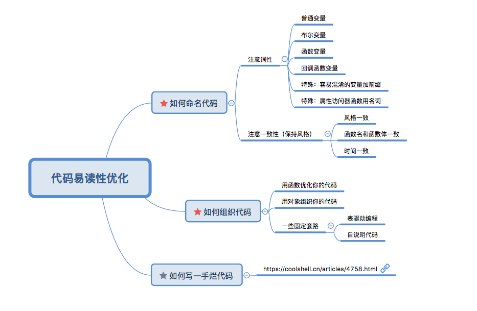

# 提高代码可读性,掌握这些就够了

今天看到一篇关于代码优化的文章,写得十分实用,在学习总结后,梳理出思维结构图,将收货的分享一下

原作者:方应杭

原文地址:https://zhuanlan.zhihu.com/p/33064124

>注意:这篇文章所指的代码优化,特指的是代码可读性方面的一些写法优化,而不是指的性能优化。

下面是我总结的一份思维导图,方便形成对文章内容结构的一个大致的印象。




首先是关于代码优化的几条原则:

- 易读性优先
- 如果不是性能瓶颈问题,不要只是为了性能优化而改写代码
- 没有银弹。无论怎么写,代码的复杂性不会消失。

关于第三条,作者也解释了,如果你这个功能逻辑一句话能说清,那你肯定不应该写上百行那么复杂,如果10分钟也讲不清楚的功能,代码也一定会体现出功能的复杂。

## ***一、如何命名代码***

这里讲的是程序员的三大难题之一,变量命名。

包括两大点:
- 要注意词性,包括6小点。
- 注意一致性(风格统一),包括4小点。

### 1.注意词性

- (1) 普通变量的命名,一般就用「名词」
```
 name: 'lvziwei',
 age : '18'
```

- (2) 布尔类型变量的命名,用「isX」或者「hasX」或者「canX」

```
    isVip:  true              表示是VIP
    hasValue: true            表示有值
    canSpeak: true            表示可以说话
```

- (3) 函数是一个动作,当然用「动词」

```
     run(){}, // 不及物动词
     drinkWater(){}, // 及物动词

```

- (4) 函数中,如果是回调函数。用「介词」开头，或用「动词的现在完成时态」

「介词」开头
```
    beforeUpdate()
    afterUpdate()

```
「动词的现在完成时态」, 典型的是Vue的生命周期钩子函数。
```
     var component = {
          beforeCreate(){},
          created(){},
          beforeMount(){},
          mounted(){},
          beforeUpdate(){},
          updated(){},
          activated(){},
          deactivated(){},
          beforeDestroy(){},
          destroyed(){},
          errorCaptured(){}
      }
```

这两种写法都很容易读,但是注意你最好只选择一种风格写法并保持,这也是下面将要提到的一致性。

- (5) 特别的 : 一些容易混淆的变量,可以添加前缀来让他们更容易读

```
    var dom1 = document.querySelector('#dom1')
    var dom2 = $('#dom2')
    
    // 这样的代码不容易读,因为dom1 dom2直觉上感觉是一类的,但是一个是dom对象,一个是JQ对象
    
    // 前缀优化: 可通过变量名称,一眼看出他们一个是DOM,一个是JQ对象
    
    var dom = document.querySelector('#dom1')
    var $dom = $('#dom2')
    
    
```

- (6) 特别的 : 属性访问器函数,可以用名词

这是一种约定成俗的命名方式吧,按说函数都用动词,但是你看到一个框架里的函数API是用的名词,那么这很可能按时这个函数是一个属性访问器。

```
JQ中的text()

$dom.text()
$dom.text('内容1')

```

### 2.注意一致性(风格统一)

- (1) 风格一致

上面提到过,下面2种风格,最好只选择其一。
```
     beforeUpdate()
     afterUpdate()
```

```
     beforeUpdate(){},
     updated(){},
```

- (2) 函数名和函数体一致

    函数名称正确的描述函数体内容,函数内容要体现函数名称

- (3) 时间一致

    随着时间推移,业务的改变可能导致当初的变量名称已经不再合适,这时候要及时修改,这也是最难做到的,因为牵一发而动全身。


## ***二、如何组织代码*** 

好了,现在我们的变量名称已经易读,容易理解了,之后干嘛?

是不是就剩下将你的变量组织起来了? 下面主要从两方面讲了如何组织代码

### 1.用函数组织你的代码

步骤：

- 将一坨代码放到一个函数里
- 将代码依赖的外部变量作为参数
- 将代码的输出作为函数的返回值
- 给函数取一个合适的名字
- 调用这个函数并传入参数
- 这个函数里的代码如果超过 5 行，则依然有优化的空间，请回到第 1 步

### 2.用对象组织你的代码

我们会用 this 来串联这个对象和所有函数。
最终代码：http://js.jirengu.com/mimazaboke/1/edit?html,js,output

### 3.一些固定套路

- 表驱动编程（《代码大全》里说的）
 所有一一对应的关系都可以用表来做
- 自说明代码（以 API 参数为例）
 把别人关心的东西放在显眼的位置


## ***三、如何写一手烂代码***

角度清奇,原作者推荐了一篇教人如何写出不可维护的代码的文章 : https://coolshell.cn/articles/4758.html


