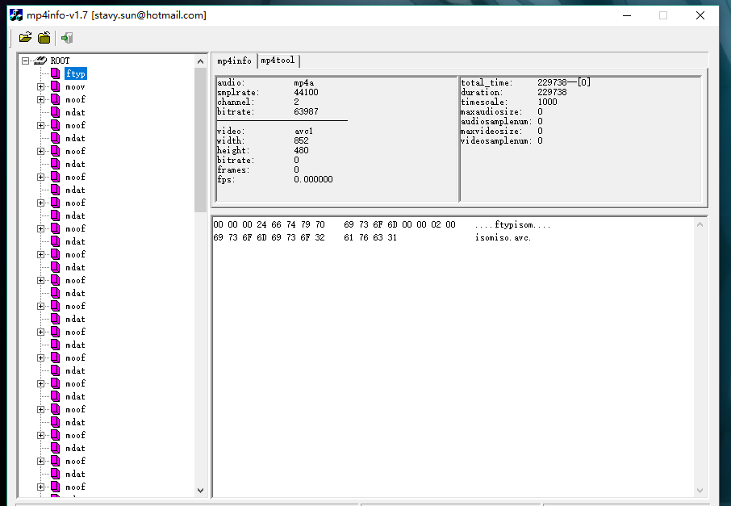

# 一道陌生领域面试题的思考

> 面试题目: 试着比较2个视频文件 xx.mp4 和 f-xx.mp4之间有什么差异?

### 一、明确思考方向和需求

由于这个是前端岗位,首先需要搞清楚是从前端做视频的角度比较差异,还是单单从视频方向回答差异。

- 关于前端视频方向,我仅仅知道html5标准中,提出专门用来制作视频的<video>,只是了解api的程度。
- 关于视频剪辑、制作方向,毫无了解

##### 我首先选择去从前端方向去尝试思考,主要尝试了以下方法:

- 1.去拉钩上找西瓜视频/bilibili招聘要求。了解视频方向涉及的技术
- 2.唯一的视频方向的知识，就是我知道html新增的video标签，然后我把MDN文档上关于video的每一个字看了一遍
- 3.去西瓜视频的网站，打开浏览器的调试工具，去看看这个视频都用了元素，引入了什么库没有。

因为前端方向实在没有思路,就去您沟通,进一步明确需求,得知是从视频方向思考,可能需要使用工具分析。

现在,需求一旦明确了,基本思路也就明朗了,看似相同的.mp4文件必然是存在差异的,只是因为知识储备的问题,我暂时不了解他们的差异。

我需要做的只是2件事情:

- 学习mp4文件的知识,了解到.mp4文件哪些地方可能有会差异。
- 这个差异很可能需要用工具才能分析出来。你需要查到,这些差异需要用什么工具分析? 工具如何使用?

### 二、前后产生3个思路

>思路1: 比较.mp4文件下的各种参数：分辨率、帧率、码率 /  RGB模型 YUV模型 / 色深 / 色度半采样 是否存在差异?

首先我查到的知识是,mp4/mkv这种视频文件,并不仅仅是格式。其实类似它于一个包裹,这个mp4的后缀代表包裹的包装方式。包裹里包括视频、音频、字母等track。

- 视频里又有一些基础参数: 基础参数：分辨率、帧率、码率
- 图像的表示方法：RGB模型 YUV模型
- 色深
- 色度半采样
- 空间上的低频和高频：平面、纹理、线条
- 时间上的低频和高频：动态

我在挨个了解了一下他们的慨念后,觉得说不定2个mp4文件的这些参数或者慨念存在一些差异。

于是去搜索mac系统下,可以查询mp4文件这些参数的mac软件。当晚睡前,我找到了一个能展示mp4数据的软件MediaInfo

使用这个软件,分别导入2个mp4文件得到的结果如图:

***xx.mp4的数据***


***f-xx.mp4的数据***


我一个一个对比各项参数,但是数据结果让我比较失望,我发现他们几乎没什么差异。

仅有的一点区别是:
```
 
xx.mp4的编码设置ID: isom(isom/iso2/avc1/mp41)
f-xx.mp4的编码设置ID: isom(isom/iso2/avc1/mp41/iso5) 


xx.mp4的平局混合码率: 530Kbps
f-xx.mp4的平局混合码率: 527Kbps


xx.mp4还多一个参数叫编码程序：Lavf57.76.100

````

所以,直觉上这个应该不是答案。


>思路2: 比较.mp4文件的编码器、解码器是否有差异?

第二天,我想起来视频一般都有编码器和解码器,比如制作视频时用了H.264的编码器,那么用户的播放器也必须支持H.264的解码器。

就产生一个想法,可能这2个视频的编码器存在差异,结果查看后发现两者都是H.264。

而且过程中我也使用到分析工具,肯定也要pass


>思路3: 比较.mp4文件的文件结构分析 ftyp / moov / mdat 是否存在差异?    ```!important```


***这个思路,是我认为的最接近正确答案的思路***,其中也遇到了一些问题,不过这个探索过程放在最后描述。

>下面是我对本道面试题的一个正式回答:

xx.mp4和f-xx.mp4,这2个视频文件相比较来说,f-xx.mp4更为特殊一点。

类似f-xx.mp4的这种mp4格式,被称为:fragment mp4,一般简称FMP4。我就直接翻译成"支离破碎的mp4"

下面是我使用mp4Info,将这2个文件结构解析后的2个截图。(mp4Info是window下的一种mp4文件结构分析工具)

***首先是xx.mp4的:***


***接下来是f-xx.mp4的:***




下面分析一下两种格式的优缺点。

 对于第一种格式，整个mp4文件的的meta数据都在文件头，所有媒体数据为整体一块。当文件比较大的时候，meta数据就比较大。这样对mp4文件的本地播放是没有问题。但对于一些视频播放网站而言，用户的播放器必须下载全meta数据才能开始播放，这就意味着用户的缓冲时间将因为mp4文件的存储结构而延长。目前一种解决方法是将大的mp4文件切成物理分离的多段，使得每段的meta都比较小，从而在一定程度上减少缓冲时间。

 对于第二种格式，mp4文件被分成多个frag分片，而原来的meta数据大大变小，且没个frag都可以单独索引、传输和播放，这样就可以解决mp4不能流式传输播放的问题。对用户体验比较好。然而目前这种格式并不被多数解码器完整支持，部分播放器加载文件时间过长，而且浏览器内嵌播放器也可能不支持播放。


补充信息1: 如果想进一步学习mp4的文件结构,这里有一个开源工具项目可以学习: 【mp4 explorer】  http://mp4explorer.codeplex.com/

补充信息2: 微软在08奥运会之前推出了此项解决方案，并应用于NBC视频直播，具体技术可以参考下面的链接：http://alexzambelli.com/blog/2009/02/10/smooth-streaming-architecture/
在其中也可以找到对mp4文件中每个box 的一些介绍。    


### 三、第3个思路下,探索答案的过程记录

至此,对于这个面试的回答已经完毕。

因为您提到,比较看重独立解决问题的过程和思路。所以特此记录一下这个过程中几个小插曲和感受

(1) 其实,我现在也读不懂,ftyp、moov、mdat下面的 00 00 00 24 66 74 79 70 这些号码的含义,不知道这个要不要深入学习。

然后我尽力去通读了几篇博客,目前我能够大致理解这些

- 常见的MP4主要由三个box组成，ftyp、mdat和moov。
- ftyp指示一些头部信息，通过ftyp box可以判断文件类型
- mdat box存放的是媒体数据，就是播放的音频实实在在的元数据，比如我们需要取到第一帧的图片数据就存放在这个box里面。
- 靠moov box来解析数据,一般情况下，一个moov box包含一个mvhd和若干个track box

(2) 寻找分析工具时遇到的困难。

我觉得 判断这个问题需要哪个工具? 在哪里能找到这些工具的资源, 这也代表了一个人的能力,不过我最后也没能找到Mac系统下的分析工具。
 
但是我找到了几个在window下能用的 mp4结构分析工具。比较着急,所以最后我是借了同事的window笔记本,在window上做的mp4结构分析。不知道这样算不算能力。。

(3) 最终问题的解决,我得感谢一篇不知名的转载文章 http://blog.csdn.net/coloriy/article/details/47106151

这篇文章正面回答了2种不同mp4文件的区别。但是在我没找到mp4文件分析工具前,也没意识到这个就是我要的,分析出mp4结构后,再次回看这篇文章
才发现这简直就是专门给我的答案,可能有点运气,真是感谢作者。


