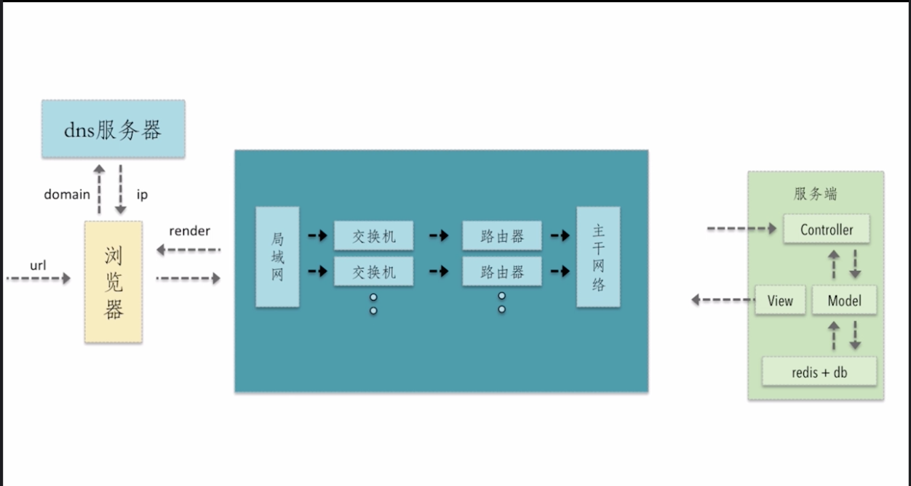

# 系统地掌握前端性能优化原理/实践


## 我对性能优化的理解。

我对性能优化的理解是,想做好性能优化,

- 首先要做的是搞清楚web开发从0-1到上线发布的整个环节。
- 搞清楚每一个环节后,结合自己的业务场景和团队技术栈,去找到最合适的方案。

这样做的性能优化,会比较全面系统,而且更加贴合业务实际。


举个栗子,浏览器的请求从发送到返回都经历了什么? 了解后我们可以从中发现可以优化的环节



- 用户输入url给浏览器
- 浏览器可以解析出url里的域名,把域名给DNS服务器,DNS服务器会把这个域名对应的IP地址返回给浏览器
- 浏览器拿到IP地址,这样浏览器就知道需要把请求发送到什么地方去了,那ip地址就跟随着HTTP协议,包括请求参数都会进入网络中
- 经过局域网、交换机、路由器、主干网络后呢,这个请求到达服务器。
- 服务器一般是MVC的架构,controller会接受并处理这个请求,然后去调用model层,model层是负责和数据交互的,交互过程中可能会从数据库读取、操作数据,通过渲染好的view层返回给网络
- 服务端的响应经过网络,返回给浏览器后,浏览器就负责render工作嘛
- 这个浏览器的render过程呢,就会把HTML渲染成DOM树,把CSS渲染成css tree,然后根据一定的规则,合并成一个render tree,之后在去布局、绘制的过程
- 然后绘制之后再去执行JS脚本。(因为一般我们把css放在顶部,js放到底部嘛)


那么大致了解整个http请求到返回的环节,就可以从中总结一些可以优化的点,比如:

- DNS服务器是否可以通过缓存,减少DNS的查询时间?
- 之后这个网络请求中,是不是可以让请求走最近的网络环境?
- 相同的静态资源应该也可以缓存
- 我们http请求应该有很多、请求资源大小也不一样,所以可以想办法减少HTTP请求
- 减少HTTP请求的大小
- 服务端渲染
- 包括浏览器render这个过程中,涉及到重绘、回流比较消耗性能。写代码的时候要减少重绘和回流。
- 包括渲染完成后再去执行JS。其实这个已经是优化的一部分了,只不过这个不优化大家也都是这样写的。


这些就是一个http请求的过程,以及从这个过程中可以进行优化的一些点。

但是肯定也是需要结合我们公司的业务需求和技术栈来优化,才是靠谱的性能优化。因为有一些优化都是有利有弊的,比如图片相关的,转成base64、用雪碧图。


## 前端优化方式的分类

试着对性能优化的方式去进行分类:

- 构建层面
- 网络层面
- 浏览器渲染层面
- 服务器层面

注意:分类后其实也是互相有交织的。比如说我合并文件、压缩图片。这个一般算是构建层面的优化,但是也可以理解为是减少http请求和数量,也是网络层面的优化。

实际上有不少优化方式,还是跟网络会有交织。

## 最常见的前端优化方式

- 1.资源的合并和压缩
- 2.图片相关的优化
- 3.浏览器渲染机制 
    + css和js的执行加载机制
    + 懒加载和预加载
    + 重绘和回流
- 4.浏览器缓存
- 5.缓存
- 6.服务端渲染

### 1.资源的合并和压缩

资源的合并和压缩,主要用构建工具做嘛,目的基本就是减少HTTP请求的数量或者减少请求资源的体积

> (1) html/css/js的压缩,还有js的混淆

> (2) js/css文件的合并。

文件合并需要注意的是, 好处是请求数量、丢包问题也会少一点。
但是合并也可能产生问题:

 - 首屏渲染问题,需要加载一个超大的css文件、加载超大的js文件
 - 缓存失效。只要改动一点点代码,整个项目的缓存都是失效的。
 
 解决:
 
 - 公共代码和业务代码分开打包
 - 不同的页面划分开,单独打包。
 

### 2.图片相关的优化

> (1) 根据业务场景,使用不同图片格式

> (2) 进行图片压缩

> (3) 用雪碧图减少HTTP请求 、 用转base64减少HTTP请求 、 用SVG矢量图

> (4) 安卓机的话,推荐用webp


根据业务场景选择不同的图片格式:

- jpg : 一般用于不需要透明图片的业务场景
- png : 一般用于需要透明图片的业务场景
- webp: 用于安卓,因为IOS可能有兼容问题
- svg : 图片样式简单的我业务场景(logo icon)

注意优化方式,也要看具体情况:

- 比如base64转码,只适合小图片
- 雪碧图在减少HTTP请求的同时,也增加了一个较大资源的HTTP请求,而且如果所有图片都放到一个大图上,也会导致首屏渲染较慢。
 

### 3.浏览器渲染机制 (css和js的执行机制 、 懒加载和预加载 、重绘和回流)

浏览器的渲染机制:

```
html --> dom tree
                    --> render tree  --> 布局 --> 绘制   
css  --> css tree

```
- 从上到下顺序执行
- css会阻塞页面渲染 (因为css一改可能就会有重绘或回流)
- js也会阻塞后续的代码的执行 (JS也可能修改DOM和样式,导致重绘和回流)


> (1) css放到顶部,避免html先加载出来,但是没有样式。然后css加载完后突然闪烁一下页面才添加样式

> (2) js放到底部,因为优先加载页面的html/css,可以让用户尽快看到页面,JS往往都是很多,放到前面可能会导致页面加载很慢。或者你一定要把script放到前面,也可以用defer/async


### 4.浏览器存储

### 5.缓存优化

### 6.ssr服务端渲染


