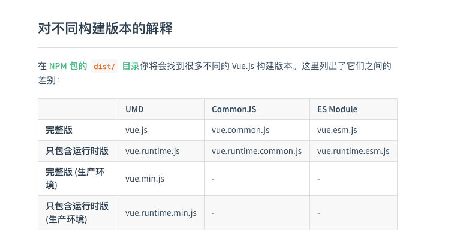

# 理顺8个版本vue的区别

### 一共8个版本的vue



- 一共8个vue版本,都是用在什么情况下的?
- 默认会用的哪个vue版本,vue-cli里用的哪个版本?
- 如何指定使用哪个版本的vue?

不急,从2个维度去理解这8个版本。

- 根据是否需要编译器分为: 运行时版本 和 完整版
- 根据这个vue代码用在什么地方: 分为UMD / CommonJS / ES Module

###  【运行时版本】和【完整版】的区别: 用不用编译?

```
完整版: 包括编译器和运行时的版本
编译器: vue里用的<template></template>语法是需要被编译的
运行时: 用来创建Vue实例、渲染、处理虚拟Dom,可以理解为除了编译器剩下的代码都属于运行时

```
如果你需要使用template的语法,就需要编译器,那么就要使用完整版

> 用了.vue文件的大多数情况下,你可以用运行时版本

当你使用vue-loader或vueify的时候, *.vue文件内部会预编译成JS,所以你在最终打好的包里,
实际上是不需要编译器的,所以这种情况,应该用运行时版本,毕竟运行时版本的体积比完整版要小30%

> 如果我一定要用完整版的呢? 如何选择版本呢?

你需要在webpack里配置alias
```
module.exports = {
  // ...
  resolve: {
    alias: {
      'vue$': 'vue/dist/vue.esm.js' // 用 webpack 1 时需用 'vue/dist/vue.common.js'
    }
  }
}


```


### UMD / CommonJS / ES Module 的区别: 你的vue用在什么地方?

- 当你通过script标签来引用vue源码时,用UMD版本
- 当你通过低版本的打包工具,比如webpack1,用CommonJS版本
- 当你通过现代打包工具比如 webpack 2 或 Rollup,用ES Module版本

### 其他

> vue源码会根据process.env.NODE_ENV来判断是用生产还是开发环境的代码

webpack里可以有自带的 new webpack.DefinePlugin()来设置process.env.NODE_ENV

类似这样
```
   new webpack.DefinePlugin({
      'process.env': env
    }),

```
